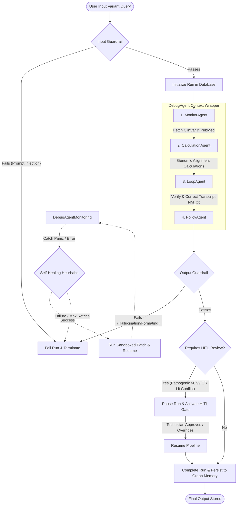
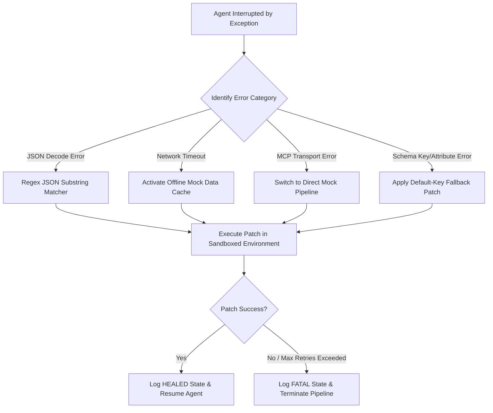
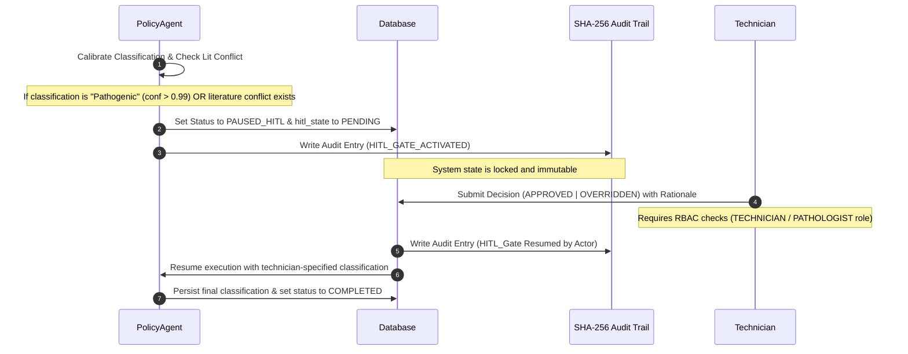

# Axon Gene AI

A production-grade, multi-agent genomic variant classification and interpretation engine. Axon Gene AI automates ACMG-tier interpretation of clinical variants by coordinating multiple specialized AI agents, backed by real-time safety guardrails, self-healing debuggers, semantic memories, and cryptographic audit chains.

---

## 🏗️ Architecture & Flowcharts

The following flowcharts detail the inner workings of the multi-agent system.

### 1. Multi-Agent Pipeline Orchestration
The core pipeline executes sequentially across specialized agents, monitored continuously by the `DebugAgent`.



---

### 2. Self-Healing & Code Patching Loop
When any agent encounters an exception (e.g., API timeout, bad JSON structure, or schema errors), the `DebugAgent` attempts to heal the execution context dynamically.



---

### 3. Human-In-The-Loop (HITL) Gate Sequence
High-risk classifications or conflicting scientific literature require authorization by an authorized clinical technician or pathologist before reporting.



---

## 🤖 The 5-Agent Orchestration Team

1. **MonitorAgent**: Connects to the local **BioMCP Server** via `stdio` transport. It retrieves raw NCBI ClinVar variant documentation and scrapes related PubMed/PMC literature citations. It also checks semantic memories for any prior variants.
2. **CalculationAgent**: Performs deterministic genomic alignment and consequence calculations (frameshift, missense, synonymous, nonsense, etc.) mapping genomic locations to transcript coordinates.
3. **LoopAgent (Analysis Integrity & Self-Correction)**: Assesses data completeness. If transcript references (e.g., `NM_x.x` versioning) are missing, it scans the literature text to recover the correct version and re-triggers the genomic alignment.
4. **PolicyAgent**: Implements clinical classification policies based on the ACMG Guidelines. It calibrates classification confidence and resolves discrepancies when PubMed articles show conflicting clinical claims.
5. **DebugAgent**: A meta-agent wrapper. It monitors every step, intercepts exceptions, generates sandboxed Python patches, logs code fixes to the long-term DB, and retries the failed agent up to 3 times.

---

## 🔒 Security, Safety, & Auditing

* **Input Guardrail**: Scans user inputs to detect and block prompt injection attempts, sanitizing strings before downstream ingestion.
* **Output Guardrail**: Validates generated variant names and transcripts against verified NCBI structures to prevent AI hallucinations.
* **Cryptographic Hash Chain**: Every state transition of a run generates a SHA-256 hash incorporating the previous state's hash, creating an immutable audit trail.
* **Sandboxed Patching**: Dynamically generated self-healing patches are executed within isolated scopes to prevent execution of malicious code.
* **Role-Based Access Control (RBAC)**: Enforces that only authorized accounts with appropriate credentials can review and approve paused clinical gates.

---

## 💻 Tech Stack

* **Backend**: FastAPI, Python 3.10+, SQLite (Episodic + Semantic recall storage), FastMCP.
* **Frontend**: HTML5, Vanilla CSS3 (Rich glassmorphic design system), Vanilla JS.
* **Protocols**: Model Context Protocol (MCP) for tool binding.

---

## 🚀 Getting Started

### Prerequisites
* Python 3.10+
* Git
* GitHub CLI (`gh`) (for repository management)

### Installation & Run
1. Clone this repository (if pulling down):
   ```bash
   git clone <your-repository-url>
   cd "capstone project 2"
   ```
2. Set up a virtual environment and install dependencies:
   ```bash
   python -m venv .venv
   # Windows:
   .venv\Scripts\activate
   # macOS/Linux:
   source .venv/bin/activate

   pip install -r requirements.txt
   ```
3. Run the application:
   * On Windows: Double-click or run `run_app.bat` (or use PowerShell `.\run_app.ps1`).
   * Alternatively, start it manually:
     ```bash
     uvicorn backend.main:app --reload --port 8000
     ```
4. Access the frontend dashboard at: `http://localhost:8000/static/index.html`
